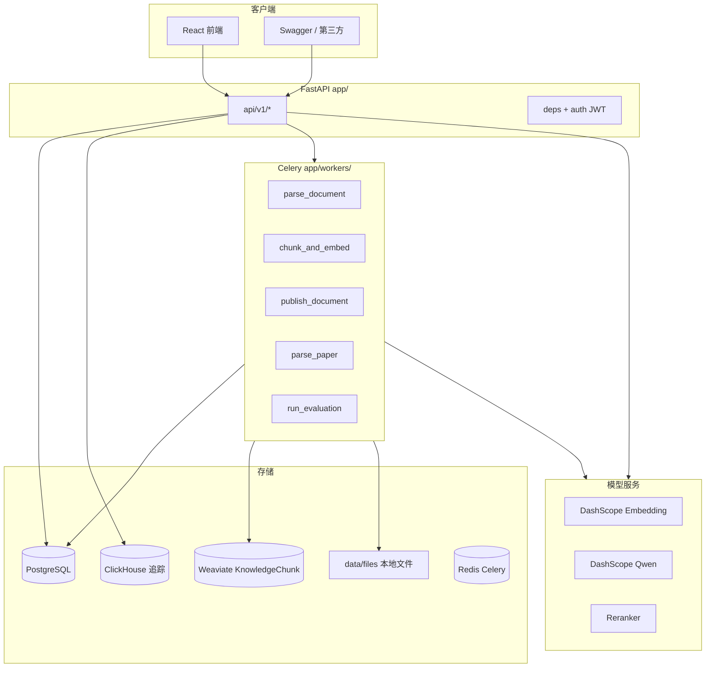
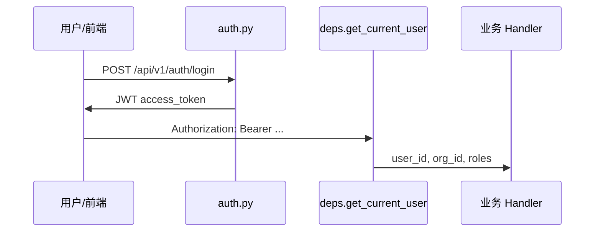
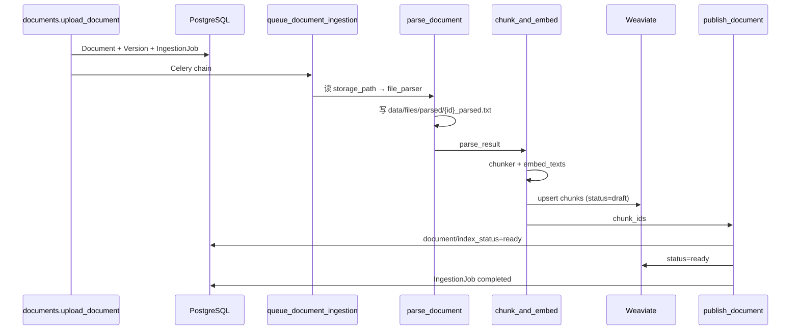
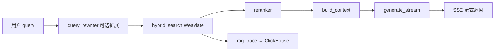
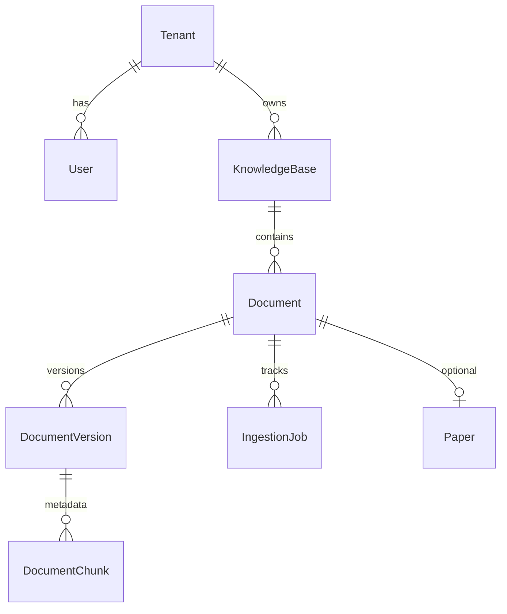

# RAG 知识库 — 代码概览与阅读指南

本文档面向需要**快速熟悉业务与设计流程**的开发者，说明项目分层、核心数据流、推荐阅读顺序，以及各目录职责。配合 `README.md` 中的启动说明使用。

---

## 1. 项目是什么

企业级 **RAG（检索增强生成）知识库**：用户创建知识库 → 上传文档/论文 → 异步解析与向量化 → 混合检索 + 重排 → LLM 流式问答，并附带评测、反馈、审计与分析能力。



---

## 2. 技术栈与外部依赖

| 组件 | 用途 | 配置入口 |
|------|------|----------|
| FastAPI | HTTP API、`/docs` | `app/main.py` |
| SQLAlchemy 异步 | 业务元数据 | `app/database.py`、`app/models/` |
| Celery + Redis | 文档/论文解析、评测 | `app/workers/celery_app.py` |
| Weaviate | 向量 + 混合检索 | `app/services/weaviate_client.py` |
| PostgreSQL | KB、文档、任务、用户等 | `config.py` → `app/config.py` |
| ClickHouse | RAG 链路追踪事件 | `app/services/clickhouse.py` |
| DashScope | Embedding / LLM / 部分增强 | `app/services/embedding.py`、`llm.py` |
| React + Vite | 管理端 UI | `frontend/src/` |

**配置加载顺序**：根目录 `config.py` 中的常量 → `app/config.py` 的 `Settings`（可被环境变量 / `.env` 覆盖）。改连接信息时优先看清是否被 `.env` 覆盖。

---

## 3. 目录结构（按阅读优先级）

```text
rag/
├── app/                    ★ 后端核心（从这里开始）
│   ├── main.py             应用入口、CORS、Weaviate 启动检查
│   ├── config.py           Settings（读根 config.py）
│   ├── database.py         异步引擎与 session
│   ├── auth.py             JWT、密码哈希
│   ├── api/
│   │   ├── deps.py         Bearer JWT 鉴权依赖
│   │   └── v1/             按业务拆分的 REST 路由
│   ├── models/             SQLAlchemy 表模型
│   ├── schemas/            Pydantic 请求/响应 DTO
│   ├── services/           业务逻辑（RAG、解析、向量库等）
│   └── workers/            Celery 任务定义
├── frontend/src/           ★ 前端页面与 API 封装
├── tests/                  按模块划分的 pytest
├── scripts/                init_db、init_weaviate、seed_user
├── migrations/             Alembic（若使用迁移）
├── data/files/             上传原文件与 parsed 文本
├── config.py               项目级连接常量
└── docs/                   设计文档与本概览
```

---

## 4. 推荐阅读顺序

按目标选择路径，避免从测试或脚本入手。

### 4.1 第一次通读（约 2～3 小时）

| 顺序 | 文件 | 目的 |
|------|------|------|
| 1 | `app/main.py` | 应用如何挂载路由、启动时做什么 |
| 2 | `app/api/v1/router.py` | 有哪些 API 模块 |
| 3 | `app/api/deps.py` + `app/auth.py` | 鉴权如何在每个接口生效 |
| 4 | `app/models/*.py` | 领域实体与表关系 |
| 5 | `app/api/v1/kbs.py` → `documents.py` | 最小业务闭环：建库、上传 |
| 6 | `app/workers/tasks.py` 中 `queue_document_ingestion` 及三个 chain 任务 | 入库流水线 |
| 7 | `app/services/rag.py` 中 `assemble_context_and_generate` | 问答主路径 |
| 8 | `app/api/v1/chat.py`、`search.py` | API 如何调用 RAG |
| 9 | `frontend/src/App.jsx` → `api.js` → `pages/Chat.jsx` | 前端如何对接 |

### 4.2 只关心「文档怎么进向量库」

1. `app/api/v1/documents.py` — `upload_document`
2. `app/workers/tasks.py` — `queue_document_ingestion` → `parse_document_task` → `chunk_and_embed_*` → `publish_document_*`
3. `app/services/file_parser.py` — 多格式解析
4. `app/services/chunker.py` — 普通文档分块
5. `app/services/embedding.py` + `weaviate_client.py` — 写入 `KnowledgeChunk`

### 4.3 只关心「问答/检索怎么工作」

1. `app/api/v1/chat.py` 或 `search.py`
2. `app/services/rag.py` — `hybrid_search` → `rerank_sources` → `build_context` → `assemble_context_and_generate`
3. `app/services/query_rewriter.py`、`reranker.py`、`llm.py`
4. `app/services/rag_trace.py` + `clickhouse.py` — 可观测性

### 4.4 只关心「论文」

1. `app/api/v1/papers.py`
2. `app/workers/tasks.py` — `parse_paper_task`
3. `app/services/paper_parser.py` → `paper_chunker.py` → `metadata_enhancer.py`

### 4.5 评测与分析

1. `app/api/v1/analytics.py`
2. `app/workers/tasks.py` — `run_evaluation_task`
3. `app/models/audit.py`
4. `app/services/audit.py`

---

## 5. 分层职责

```text
HTTP 请求
    ↓
api/v1/*.py          参数校验、权限(org_id)、调 DB/入队、返回 schemas
    ↓
services/*.py        可复用领域逻辑（不绑 FastAPI）
    ↓
models/*.py          表结构；workers 里也会直接 update
    ↓
PostgreSQL / Weaviate / 文件系统 / 外部 API
```

- **不要在 `api/` 里堆复杂算法**：检索、分块、LLM 均在 `services/`。
- **长耗时操作走 Celery**：解析、embedding、评测；API 只负责落库 + `apply_async`。
- **向量检索的唯一集合名**：`KnowledgeChunk`（见 `weaviate_client.COLLECTION_NAME`）。

---

## 6. 核心业务流程

### 6.1 鉴权



- 登录：`app/api/v1/auth.py`
- Token 解析：`app/auth.py` → `app/api/deps.py`
- 初始化账号：`python scripts/seed_user.py`（默认 `admin` / `admin123`）

除健康检查外，多数 `/api/v1/*` 需要 `get_current_user`，并按 `org_id` 做租户隔离。

### 6.2 普通文档入库（主路径）



**关键函数**：

- 入队：`app/workers/tasks.py` → `queue_document_ingestion()`
- 上传触发：`app/api/v1/documents.py` 在 commit 后调用上述函数
- 失败重试：`app/api/v1/ingestion.py` → `retry_ingestion_job`

**状态字段**：

| 实体 | 字段 | 含义 |
|------|------|------|
| `Document` | `status` | `draft` → `ready` / `failed` |
| `DocumentVersion` | `index_status` | 索引进度 |
| `IngestionJob` | `status` | `pending` / `running` / `completed` / `failed` |
| Weaviate chunk | `status` | 先 `draft`，发布后 `ready`；检索只查 `ready` |

### 6.3 RAG 问答



入口：

- 流式聊天：`POST /api/v1/chat` → `assemble_context_and_generate()`（`app/services/rag.py`）
- 仅检索：`POST /api/v1/search` → `hybrid_search` + 可选 rerank

检索过滤（`rag._build_where_filter`）固定包含：`org_id`、`status=ready`，以及可选 `kb_ids`。

### 6.4 论文处理

论文走**单任务** `parse_paper_task`（非三阶段 chain），内部顺序：

解析 PDF（`paper_parser`）→ CrossRef/PubMed 元数据增强 → 医学实体抽取 → 更新 `Paper` 表 → `paper_chunker` 分块 → embedding → 直接写入 Weaviate（`status=ready`，`document_type=paper`）。

API：`app/api/v1/papers.py`（上传 / DOI / PMID 导入及证据、相似论文等读接口）。

---

## 7. 数据模型关系（PostgreSQL）



| 模型文件 | 表 | 说明 |
|----------|-----|------|
| `tenant.py` | tenants, users, roles | 多租户与用户 |
| `kb.py` | knowledge_bases | 知识库 |
| `document.py` | documents, document_versions | 文件与版本 |
| `chunk.py` | document_chunks | 块元数据（向量在 Weaviate） |
| `task.py` | ingestion_jobs | 解析任务状态 |
| `paper.py` | papers | 论文专属字段 |
| `audit.py` | audit_logs, feedback, evaluation_* | 运营与评测 |

Weaviate 中每条记录通过 `org_id`、`kb_id`、`document_id`、`document_version_id` 与 PG 关联；`chunk_id` 与对象 UUID 一致（由 `uuid5` 确定性生成，便于重试幂等）。

---

## 8. API 路由索引

所有业务路由前缀均为 **`/api/v1`**（`app/api/v1/router.py`）。

| 模块 | 前缀/路径 | 文件 | 典型能力 |
|------|-----------|------|----------|
| 认证 | `/auth/login` | `auth.py` | 登录拿 JWT |
| 知识库 | `/kbs` | `kbs.py` | CRUD |
| 文档 | `/kbs/{kb_id}/documents`、`/documents/{id}` | `documents.py` | 上传、列表、删除 |
| 入库任务 | `/ingestion-jobs/{id}` | `ingestion.py` | 查询、重试 |
| 聊天 | `/chat` | `chat.py` | SSE 流式 RAG |
| 搜索 | `/search` | `search.py` | 混合检索 |
| 论文 | `/papers/*` | `papers.py` | 上传、DOI/PMID、证据 |
| 分析 | `/answers/.../feedback`、`/evaluation-*`、`/analytics/*`、`/audit-logs` | `analytics.py` | 反馈、评测、统计 |

本地调试：启动后打开 `http://localhost:8000/docs` 可看到完整 OpenAPI。

---

## 9. `app/services/` 服务一览

| 文件 | 职责 |
|------|------|
| `rag.py` | 混合检索、重排、组上下文、流式生成（**核心**） |
| `weaviate_client.py` | 客户端、Collection  schema、`ensure_collection` |
| `embedding.py` | 文本向量化（DashScope） |
| `llm.py` | 流式生成 |
| `query_rewriter.py` | 查询扩展 |
| `reranker.py` | 检索结果重排 |
| `file_parser.py` | 通用文档解析（pdf/docx/txt 等） |
| `chunker.py` | 通用文档分块 |
| `paper_parser.py` | 学术论文 PDF 解析 |
| `paper_chunker.py` | 按章节分块 |
| `metadata_enhancer.py` | CrossRef / PubMed / 实体 |
| `rag_trace.py` | 链路步骤记录 |
| `clickhouse.py` | 追踪事件写入 |
| `audit.py` | 审计日志写入 |

新增能力时：优先在 `services/` 实现，再由 `api/` 或 `workers/` 调用。

---

## 10. Celery 任务一览

定义于 `app/workers/tasks.py`，注册在 `celery_app.include`。

| 任务名 | 触发方 | 说明 |
|--------|--------|------|
| `parse_document` | chain 第一步 | 解析文件 → parsed txt |
| `chunk_and_embed` | chain / 独立 | 分块 + 向量 + 写 Weaviate |
| `chunk_and_embed_from_parse` | chain 适配器 | 承接 parse 输出 |
| `publish_document` | chain 最后 | PG + Weaviate 状态改为 ready |
| `publish_document_from_chunks` | chain 适配器 | 承接 embed 输出 |
| `parse_paper` | papers API | 论文一站式流水线 |
| `run_evaluation` | analytics API | 对评测集跑检索指标 |

Worker 内异步 DB 通过专用线程事件循环 `_run_async()` 执行，避免与 Celery 进程模型冲突。

---

## 11. 前端阅读要点

| 文件 | 说明 |
|------|------|
| `frontend/src/main.jsx` | 入口 |
| `frontend/src/App.jsx` | 路由：chat / kbs / papers / analytics / evaluation |
| `frontend/src/context.jsx` | 登录态、token |
| `frontend/src/api.js` | 与后端 `/api/v1` 一一对应的 axios 封装 |
| `frontend/src/pages/*.jsx` | 各业务页 |
| `frontend/vite.config.js` | 开发代理 `/api` → `localhost:8000` |

阅读后端某接口时，可在 `api.js` 搜索路径名快速找到 UI 调用点。

---

## 12. 测试与脚本

| 路径 | 用途 |
|------|------|
| `tests/test_rag.py`、`test_rag_v2.py` | RAG 管道 |
| `tests/test_api_*.py` | 各 API 模块 |
| `tests/test_workers.py` | Celery 任务（常 mock） |
| `tests/conftest.py` | fixtures |
| `scripts/init_db.py` | 建表 |
| `scripts/init_weaviate.py` | 初始化向量集合 |
| `scripts/seed_user.py` | 默认管理员 |

跑测试：`pytest`（见 `README.md`）。

---

## 13. 日志与排错

- 应用日志：`app/logging_config.py`，请求带 `RequestLoggingMiddleware`
- Worker / API 运行日志：项目 `logs/` 目录（若通过 Makefile 启动）
- 文档解析失败：查 `IngestionJob.error_code` / `error_message`，或 `ingestion-jobs` API
- 检索无结果：确认 Weaviate 中 chunk `status=ready` 且 `org_id`、`kb_id` 与请求一致
- RAG 无引用：看 `rag.py` 中 “未找到相关的参考资料” 分支（空 context）

---

## 14. 与 README 的差异说明（阅读时注意）

- **登录接口已存在**：`app/api/v1/auth.py` 已注册；可用 `scripts/seed_user.py` 创建初始用户。
- **文档上传会串联完整入库链**：`queue_document_ingestion` 已实现 parse → chunk/embed → publish。
- **设计文档**：`docs/technical-design*.md` 若编码异常，以本概览与源码为准。

---

## 15. 扩展开发检查清单

在改代码前自问：

1. 是否带 `org_id` 过滤（API + Weaviate）？
2. 新索引数据是否设置正确的 `status`（检索仅 `ready`）？
3. 长任务是否应进 Celery 而非阻塞 `async def` 路由？
4. 配置是否应加在 `config.py` / `app/config.py` 并在 `.env.example` 说明？
5. 是否需同步更新 `frontend/src/api.js` 与 `tests/test_api_*`？

---

## 16. 相关文档

| 文档 | 内容 |
|------|------|
| `README.md` | 安装、启动、常用命令 |
| `docs/function-test-manual.md` | 功能测试手册 |
| `docs/technical-design.md` | 技术设计（注意文件编码） |
| 本文档 | 代码结构与阅读路径 |

---

*文档根据仓库当前源码整理；若实现变更，请以 `app/` 与 `app/workers/tasks.py` 为准并同步更新本节。*
