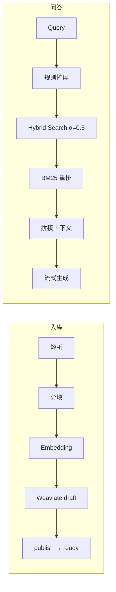

# RAG 核心链路 — 待改进项

本文档记录 RAG 核心链路的现状评估、缺口分析与改进优先级。**不涉及**权限、安全、部署层面。  
基于当前源码整理，若实现变更请同步更新本文档。

相关阅读：[代码概览](code-overview.md)

---

## 1. 当前链路全景

项目已具备完整可运行的 MVP 链路：

### 已有能力（值得保留）

| 模块 | 现状 |
|------|------|
| 入库编排 | Celery 三阶段链（parse → embed → publish）+ `uuid5` 幂等 upsert |
| 向量检索 | Weaviate hybrid + 租户/状态过滤 |
| 查询扩展 | 医学词典 + 药名归一化（`query_rewriter.py`） |
| 论文管线 | GROBID 解析、章节分块、CrossRef/PubMed 元数据增强 |
| 可观测性骨架 | Trace（ClickHouse + PG）、用户反馈、简化评测 |

---

## 2. 分阶段缺口与不足

### 2.1 文档入库 / 解析 / 分块

| 现状 | 问题 | 大厂典型做法 |
|------|------|-------------|
| PDF 用 PyMuPDF 纯文本抽取 | 表格、多栏、页眉页脚、图表信息丢失 | Layout Parser（Unstructured、Azure DI、MinerU）+ OCR |
| 仅 pdf/docx/txt/md | 企业常见格式缺失 | HTML、PPT、Excel、Confluence、Wiki 统一接入 |
| tiktoken 标题感知 + 滑动窗口 | 无语义边界，chunk 可能在句中切断 | 语义分块 / LLM 分块 / 结构感知分块 |
| `DocumentChunk` 表有定义但未写入 | PG 与 Weaviate 元数据双轨断裂 | PG 存 chunk 元数据，向量库只存向量 + ID |
| 删除文档只软删 PG | Weaviate 向量不清理，脏数据持续被检索 | 删除/更新触发异步向量清理 |
| `parent_chunk_id` 字段未用 | 无 small-to-big / parent-child 检索 | 小块检索、大块组装上下文 |

**论文管线补充：** `SECTION_BOOST` 仅存在于分块逻辑，未进入检索打分。

**相关文件：** `app/services/file_parser.py`、`chunker.py`、`paper_parser.py`、`paper_chunker.py`、`app/workers/tasks.py`、`app/api/v1/documents.py`

---

### 2.2 Embedding / 索引

| 现状 | 问题 | 大厂典型做法 |
|------|------|-------------|
| 单一 DashScope embedding | 换模型无 re-embed 管线 | 多版本 embedding 共存 + 灰度迁移 |
| 全租户共用一个 `KnowledgeChunk` 集合 | 大规模时难做隔离调优 | 按租户/KB/领域分集合或分片 |
| `domain_tags` / `entities` 写入但未用于检索 | 元数据增强做了，检索没用上 | 元数据过滤 + boost + 多路召回 |
| BM25 依赖 Weaviate hybrid 内置 | 对中文分词、专有名词控制力弱 | 自建 sparse index（ES/BM25）+ 领域词典 |

**相关文件：** `app/services/embedding.py`、`weaviate_client.py`、`app/workers/tasks.py`

---

### 2.3 检索（差距最大之一）

核心实现：`app/services/rag.py` → `hybrid_search()`，hybrid `alpha=0.5` 硬编码。

| 现状 | 问题 | 大厂典型做法 |
|------|------|-------------|
| hybrid α=0.5 硬编码 | 无法按场景/KB 调参 | 自动调参或 per-KB 配置 |
| 重排是本地 BM25 | 配置写了 `bge` 但未实现，无 Cross-Encoder | BGE/Cohere/Jina reranker |
| 仅 chunk_id 去重 | 同源文档多个 chunk 占满 top-k | MMR 多样性、文档级去重 |
| search 与 chat 路径不一致 | search 无扩展、无重排 | 统一 Retrieval Service |
| `write_retrieval_hit()` 从未调用 | 无法分析 rank 变化、cite 率 | 每次检索写 hit 事件，驱动迭代 |
| 无降级策略 | 零结果直接失败 | 放宽 filter → dense-only → 扩大 top_k |

**search API 问题：** `vector_score`、`bm25_score`、`combined_score` 均填同一 `score`（`app/api/v1/search.py`）。

**相关文件：** `app/services/rag.py`、`reranker.py`、`app/api/v1/search.py`、`app/api/v1/chat.py`、`app/services/clickhouse.py`

---

### 2.4 查询理解

| 现状 | 问题 | 大厂典型做法 |
|------|------|-------------|
| 规则词典扩展（医学） | 覆盖面窄，扩展 query 无上限 | UMLS/MedDRA 或 LLM 改写 |
| 对话历史拼接到检索 query | 简单字符串拼接，易污染 embedding | LLM 指代消解 / 独立 rewrite 步骤 |
| `planner_mode=langgraph` 配置存在 | 无实现 | Query 路由、分解、HyDE、多跳检索 |
| 无 query decomposition | 复合问题检索差 | 拆子问题 → 并行检索 → 融合 |

**相关文件：** `app/services/query_rewriter.py`、`app/services/rag.py`（`_build_history_aware_query`）、`app/config.py`

---

### 2.5 上下文组装 / Prompt

| 现状 | 问题 | 大厂典型做法 |
|------|------|-------------|
| 固定取 top 8 chunk 拼接 | 无 token 预算，可能超 context window | 按模型窗口动态裁剪 |
| 全文 chunk 入 prompt | 噪声大、成本高 | Contextual Compression（LLM 摘要过滤） |
| 参考资料塞在 system message | 部分模型对 system 中长上下文利用差 | 结构化 evidence block + 位置优化 |
| `prompt_version = "v1"` 硬编码 | 无法 A/B | Prompt 版本管理 + 实验平台 |

**相关文件：** `app/services/rag.py`（`build_context`）、`app/services/llm.py`

---

### 2.6 生成与后处理（差距第二大）

| 现状 | 问题 | 大厂典型做法 |
|------|------|-------------|
| Prompt 约束引用 | 无程序化校验，幻觉引用无法拦截 | 引用对齐：解析 [n] → 回查 chunk → 相似度打分 |
| 无 faithfulness 检测 | 说了「基于资料」但可能编造 | NLI / LLM-as-judge 校验每条 claim |
| trace 声明了 `citation` step 但未记录 | 可观测性断层 | 逐步记录 cite 命中率 |
| token 用量、首 token 延迟未采集 | 无法做成本/性能优化 | 全链路 latency + cost 归因 |
| sources 仅在流结束时返回 | 前端无法边生成边展示引用 | 检索完成即返回 sources |

**相关文件：** `app/services/llm.py`、`app/services/rag.py`（`assemble_context_and_generate`）、`app/services/rag_trace.py`

---

### 2.7 评测与闭环

评测任务（`run_evaluation_task`）只跑 `hybrid_search`，不算 rerank、不跑 LLM。

| 现状 | 问题 | 大厂典型做法 |
|------|------|-------------|
| recall@10（doc 级） | 非 chunk 级、非 MRR/NDCG | 标准 IR 指标 + chunk 级标注 |
| 不用 `expected_answer` | 无法评答案质量 | RAGAS（faithfulness、answer relevancy） |
| 用户反馈只存 rating | 未反哺检索/重排 | 点击/反馈 → 训练 reranker / 调权重 |
| 无线上 A/B | 改 prompt/参数无法科学对比 | 实验平台 + 统计显著性 |
| `retrieval_hit_events` 表无生产写入 | 无法分析精排前后变化 | 检索命中事件全量落库 |

**相关文件：** `app/workers/tasks.py`、`app/api/v1/analytics.py`、`app/models/audit.py`、`app/services/clickhouse.py`

---

## 3. 待改进项清单（按优先级）

### P0 — 投入小、收益大

| # | 改进项 | 说明 | 主要涉及 |
|---|--------|------|----------|
| P0-1 | 落地 Cross-Encoder 重排 | 实现 `BGEReranker`，对接 `reranker_type=bge` 配置 | `reranker.py`、`config.py` |
| P0-2 | 统一检索路径 | search / chat / evaluation 均走：扩展 → hybrid → rerank | `rag.py`、`search.py`、`tasks.py` |
| P0-3 | 向量生命周期管理 | 文档删除/更新时异步清理 Weaviate；`DocumentChunk` 真正落库 | `documents.py`、`tasks.py`、`chunk.py` |
| P0-4 | 引用校验后处理 | 解析答案中 `[n]`，与 citations 对齐，低置信度标注或拒答 | `rag.py` 或新建 `citation_validator.py` |
| P0-5 | Token 预算管理 | `build_context` 按模型 context window 动态裁剪，替代固定 8 块 | `rag.py`、`llm.py`、`config.py` |

### P1 — 中期架构升级

| # | 改进项 | 说明 | 主要涉及 |
|---|--------|------|----------|
| P1-1 | LLM Query Rewrite | 指代消解、意图澄清，替代简单历史拼接 | `query_rewriter.py` |
| P1-2 | Parent-Child 索引 | 小块检索、父块/相邻块扩展上下文 | `chunker.py`、`tasks.py`、`weaviate_client.py` |
| P1-3 | Contextual Compression | 检索多条后压缩到真正相关的子集再入 prompt | 新建 service |
| P1-4 | 端到端评测 | RAGAS + 检索 hit 事件写入 + 对齐线上检索链 | `tasks.py`、`clickhouse.py` |
| P1-5 | 布局感知解析 | 表格、多栏 PDF 质量提升 | `file_parser.py`、`paper_parser.py` |
| P1-6 | 论文章节 boost 参与检索 | `SECTION_BOOST` 写入 Weaviate 并用于打分 | `paper_chunker.py`、`rag.py` |
| P1-7 | 检索降级策略 | 零结果时放宽 filter、切换 dense-only、扩大 top_k | `rag.py` |
| P1-8 | 分离 search 分数字段 | `vector_score` / `bm25_score` / `combined_score` 分别返回 | `rag.py`、`search.py` |

### P2 — 逼近大厂水平

| # | 改进项 | 说明 | 主要涉及 |
|---|--------|------|----------|
| P2-1 | Query Decomposition + 多跳检索 | 落地 `planner_mode`，复合问题拆分并行检索 | 新建 planner service |
| P2-2 | 反馈闭环训练 | 用户反馈驱动 rerank 权重或 LTR | `analytics.py`、评测/训练管线 |
| P2-3 | 多向量/多索引策略 | dense + sparse + metadata 三路融合 | `rag.py`、索引层 |
| P2-4 | Agentic RAG | 检索 ↔ 推理 ↔ 再检索循环 | 新建 agent 层 |
| P2-5 | 多格式文档接入 | HTML、PPT、Excel、Wiki 等 | `file_parser.py` |
| P2-6 | Embedding 版本迁移 | 换模型时的 re-embed 与灰度切换 | `embedding.py`、`tasks.py` |
| P2-7 | Prompt A/B 与版本管理 | 实验平台化 prompt 迭代 | `llm.py`、配置/运营层 |

---

## 4. 对比大厂能力矩阵

| 能力层 | 当前 | 大厂级 RAG | 差距本质 |
|--------|------|-----------|----------|
| 数据工程 | 基础解析 + 规则分块 | 多模态解析、清洗流水线、质量评分 | 入库质量决定天花板 |
| 索引架构 | 单向量 + 单集合 | 分层索引、多粒度、增量更新 | 检索召回率与新鲜度 |
| 检索引擎 | hybrid + 规则 BM25 | 多路召回 + 神经重排 + LTR | **精排能力差距最大** |
| Query Intelligence | 词典扩展 | LLM 理解 + 路由 + 分解 + 多跳 | 复杂问题处理能力 |
| Context Engineering | 简单拼接 | 压缩、排序、token 优化、结构化 | 成本与准确率 |
| 生成治理 | Prompt 约束 | 引用校验、幻觉检测、拒答策略 | **可信度差距** |
| 评测体系 | 检索 recall | 端到端 + 人工 + 自动 + A/B | 无法科学迭代 |
| 闭环运营 | 反馈存储 | 反馈驱动模型/策略迭代 | 系统不会「越用越好」 |

### 成熟度一句话

> 骨架完整（入库链、混合检索、流式问答、trace 框架），但肌肉不足。距离「能持续迭代的生产 RAG」还差：**一层检索质量 + 一层答案可信度 + 一套评测闭环**。

---

## 5. 建议优先落地的三件事

结合生命健康领域定位，若资源有限，建议先做：

1. **P0-1：BGE / Cross-Encoder 重排** — 1～2 天可落地，检索精度提升最明显  
2. **P0-4 + P0-5：引用校验 + Token 预算** — 直接提升答案可信度与稳定性  
3. **P0-2 + P1-4：评测链路对齐线上** — 扩展 + rerank + 可选生成 + RAGAS，后续改动才有据可依  

---

## 6. 配置/文档与代码不一致项

以下在设计或配置中存在，但代码未落地，改进时需对齐：

| 配置/文档 | 现状 |
|-----------|------|
| `reranker_type=bge`、`rerank_model_name` | 仅 BM25 / Mock 实现 |
| `planner_mode=langgraph` | 无 planner 实现 |
| `docs/technical-design-v2.md` 删除文档异步清理 Weaviate | 仅 PG 软删除 |
| `rag_trace` 的 `citation` step | 声明但未记录 |
| `retrieval_hit_events` ClickHouse 表 | API 存在，生产路径未写入 |

---

## 7. 关键源码索引

| 流水线阶段 | 核心文件 |
|-----------|----------|
| 入库编排 | `app/workers/tasks.py` |
| 解析 | `app/services/file_parser.py`、`paper_parser.py` |
| 分块 | `app/services/chunker.py`、`paper_chunker.py` |
| 向量化 | `app/services/embedding.py` |
| 向量库 | `app/services/weaviate_client.py` |
| RAG 主链 | `app/services/rag.py` |
| 查询扩展 | `app/services/query_rewriter.py` |
| 重排 | `app/services/reranker.py` |
| 生成 | `app/services/llm.py` |
| Chat API | `app/api/v1/chat.py` |
| Search API | `app/api/v1/search.py` |
| 评测/分析 | `app/api/v1/analytics.py`、`app/workers/tasks.py` |
| 追踪 | `app/services/rag_trace.py`、`clickhouse.py`、`rag_trace_store.py` |

---

*文档根据仓库当前源码与 RAG 链路评估整理。*
