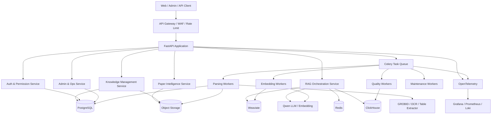
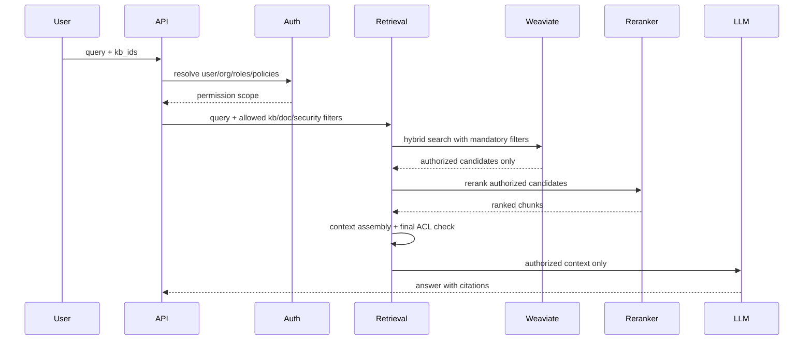
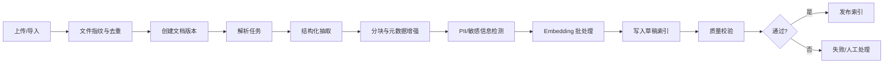
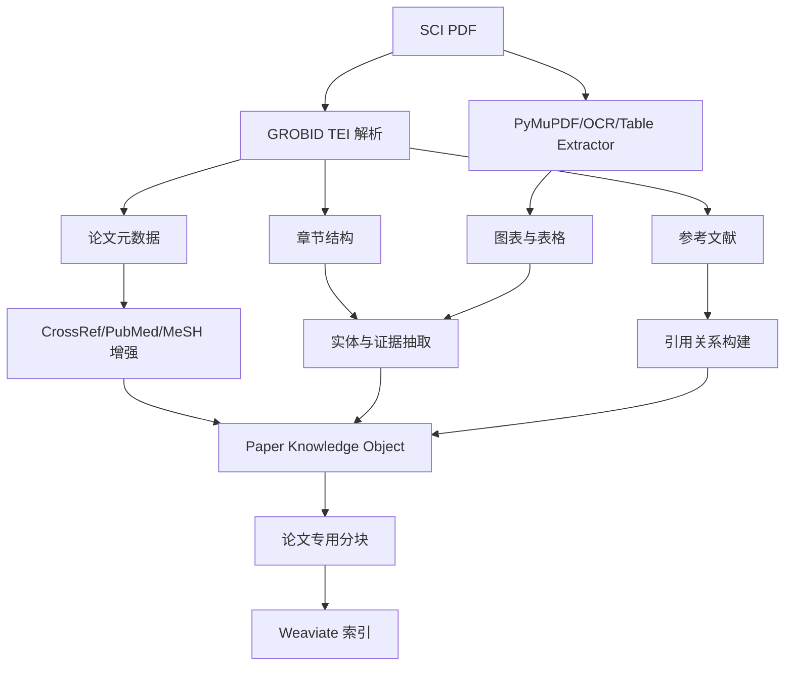

# 企业级生命健康领域知识库 — 技术方案设计文档 V2

> 基于 V1 设计文档评审后的增强版本。V2 保留既定技术选型：PostgreSQL、ClickHouse、Weaviate、千问大模型、FastAPI、Redis、Celery，并重点补强企业真实落地中的权限隔离、知识生命周期、RAG 质量评测、医学合规、SCI 论文处理和生产运维闭环。

## 0. V1 评审与优化方向

### 0.1 V1 的优点

- 技术栈清晰，PostgreSQL、Weaviate、ClickHouse 的职责划分合理。
- 覆盖了文档摄入、混合检索、重排序、RAG 生成、SCI PDF 解析、多租户和审计等核心模块。
- 能体现生命健康领域的基本特点，例如 MeSH、药物名归一化、临床指南分块、医学免责声明。
- 有基础的数据模型、API、部署和路线图，适合作为初版概念设计。

### 0.2 主要缺口

- 权限过滤位置偏后：V1 在重排序后做权限过滤，存在召回污染和越权候选进入模型上下文的风险。V2 要在检索入口、向量过滤、重排输入和上下文组装四层强制权限收敛。
- 知识生命周期不完整：缺少文档版本、索引版本、解析任务幂等、失败重试、死信队列、索引回滚、软删除和重建机制。
- RAG 质量缺少闭环：没有定义黄金测试集、召回率、引用准确率、幻觉率、医学安全指标、线上反馈如何进入优化流程。
- 企业级合规不够细：生命健康场景需要区分企业内部知识、公开论文、药品信息、临床数据、患者隐私数据，不同数据应有不同安全级别和留存策略。
- SCI 论文处理偏“解析”而非“知识化”：应补充论文章节语义、研究类型、证据等级、PICO、试验设计、结局指标、药物/疾病/基因实体抽取。
- 可观测性偏基础设施：还需要 RAG 链路级 trace、检索命中分析、低质量回答归因、任务积压和模型成本监控。
- 部署目标偏理想化：生产环境应支持从“单租户 MVP”到“多租户高可用”的渐进式演进，避免第一阶段组件过重。

### 0.3 V2 设计原则

- 安全优先：任何生成回答都不得看到用户无权访问的 chunk。
- 可追溯：每个答案必须能回溯到文档、版本、页码、段落、检索分数、模型版本和提示词版本。
- 可评测：RAG 不是一次性链路，而是持续优化系统，必须内置离线评测和线上反馈闭环。
- 可替换：Embedding、Reranker、LLM、Vector DB 客户端均通过抽象层隔离。
- 可渐进：MVP 先跑通价值闭环，企业级能力分阶段开启。
- 医学谨慎：系统定位为企业知识助手，不替代医生诊断、治疗建议或药品说明书。

---

## 1. 项目定位

### 1.1 系统目标

构建一个面向生命健康领域企业的通用知识库和智能问答平台，统一管理企业内部文档、标准操作规程、产品资料、临床指南、药品说明、科研论文和结构化知识，基于 RAG 架构提供可追溯、可审计、可权限控制的检索与问答能力。

### 1.2 典型用户

| 角色 | 典型诉求 |
|------|----------|
| 研发人员 | 检索疾病机制、靶点、药物、论文证据、实验方法 |
| 医学事务 | 查询临床指南、药品资料、医学问答资料和文献证据 |
| 注册合规 | 查询法规、申报材料、审评问答、内部 SOP |
| 市场/销售支持 | 查询已审核产品知识、竞品资料、FAQ |
| 管理员 | 管理租户、用户、知识库、权限、审计和质量指标 |
| 知识运营 | 维护文档、处理解析失败、分析零结果查询和低分反馈 |

### 1.3 数据范围

- 企业内部非结构化文档：PDF、DOCX、Markdown、HTML、TXT、Wiki。
- SCI PDF 论文：标题、摘要、章节、参考文献、图表、实验结论、元数据。
- 结构化数据：CSV、Excel、药品表、适应症表、试验登记信息。
- 外部公开元数据：CrossRef、PubMed、MeSH、期刊信息等。
- 用户行为数据：检索、问答、点击、反馈、审计。

### 1.4 非目标

- 不直接提供自动诊疗决策。
- 不绕过企业内部内容审批流程发布医学或药品结论。
- 不默认处理可识别患者数据；如需处理 PHI/PII，必须单独开启合规模式。
- 不把 LLM 生成内容作为权威知识源写回知识库，除非经过人工审核。

---

## 2. 技术选型

| 层级 | 选型 | V2 职责 |
|------|------|---------|
| 后端框架 | FastAPI | API、鉴权、RAG 编排、任务入口 |
| 元数据存储 | PostgreSQL | 租户、用户、权限、文档、版本、任务、会话、审计热数据 |
| 向量与混合检索 | Weaviate | chunk 向量、BM25、元数据过滤、多租户检索 |
| 分析存储 | ClickHouse | 检索事件、问答事件、质量评测、成本、性能分析 |
| 缓存和队列 Broker | Redis | 短期缓存、分布式锁、Celery broker、限流计数 |
| 异步任务 | Celery | 解析、OCR、GROBID、向量化、索引构建、评测任务 |
| 大模型 | 千问 Qwen | Query rewrite、生成、结构化抽取、摘要、分类 |
| Embedding | Qwen Embedding | 文档和查询向量化 |
| Reranker | BGE Reranker 或 Qwen 兼容重排模型 | 候选片段重排序 |
| 文件存储 | OSS / S3 兼容对象存储 | 原始文件、解析结果、表格图片、评测集 |
| 前端 | Next.js + React | 用户门户、管理后台、知识运营工作台 |
| 可观测性 | OpenTelemetry + Prometheus + Grafana + Loki | 链路、指标、日志、告警 |

---

## 3. 总体架构



### 3.1 服务边界

| 服务 | 职责 |
|------|------|
| API Gateway | TLS、WAF、IP 白名单、租户级限流、请求体大小限制 |
| Auth Service | SSO/OIDC/JWT、RBAC/ABAC、API Key、租户上下文 |
| Knowledge Service | 知识库、文档、版本、上传、解析状态、发布下线 |
| Ingestion Service | 文件识别、解析、分块、实体抽取、质量校验 |
| Retrieval Service | 查询改写、权限过滤、混合召回、重排、上下文组装 |
| Generation Service | 提示词管理、流式生成、引用校验、安全拦截 |
| Paper Service | SCI PDF 解析、元数据增强、引用关系、证据结构化 |
| Analytics Service | 检索/问答/成本/反馈分析 |
| Admin Service | 租户、用户、权限、配额、审计、系统配置 |

### 3.2 核心设计变化

- 权限从“后置过滤”调整为“检索前置过滤 + 全链路校验”。
- 文档从“解析完成即入库”调整为“草稿索引、质量校验、发布索引”。
- chunk 从“纯文本片段”升级为“带版本、页码、坐标、章节、权限、安全级别、模型版本的可追溯知识单元”。
- RAG 从“单次问答链路”升级为“查询理解、召回、重排、压缩、生成、引用校验、评测归因”的闭环系统。

---

## 4. 权限与多租户设计

### 4.1 租户隔离策略

| 层级 | 策略 |
|------|------|
| PostgreSQL | 所有核心表包含 `org_id`；重要表启用 Row Level Security；复合索引以 `org_id` 开头 |
| Weaviate | 每个 chunk 写入 `org_id`、`kb_id`、`acl_hash`、`security_level`；查询必须附加 where 过滤 |
| ClickHouse | 事件表包含 `org_id`；查询层强制租户过滤；敏感 query 可脱敏入库 |
| Redis | Key 前缀包含 `org_id`；租户级缓存隔离 |
| Object Storage | 路径按 `org_id/kb_id/document_id/version` 分区；服务端加密 |

### 4.2 权限模型

采用 RBAC + ABAC 混合模型：

- RBAC 解决角色授权：Org Admin、KB Admin、Editor、Viewer、Auditor。
- ABAC 解决细粒度策略：部门、项目组、安全级别、文档标签、有效期、审批状态。

### 4.3 权限校验链路



### 4.4 安全级别

| 级别 | 示例 | 控制策略 |
|------|------|----------|
| Public | 公开论文、公开指南 | 普通访问，可缓存 |
| Internal | 内部 SOP、培训材料 | 登录访问，租户隔离 |
| Confidential | 研发资料、未发布产品信息 | 部门/项目授权，禁止导出 |
| Restricted | 患者数据、敏感商业数据 | 单独开关、脱敏、强审计、默认不进入通用 RAG |

---

## 5. 数据模型 V2

### 5.1 PostgreSQL 核心表增强

#### 5.1.1 文档生命周期

```sql
CREATE TABLE documents (
    id              UUID PRIMARY KEY DEFAULT gen_random_uuid(),
    org_id          UUID NOT NULL,
    kb_id           UUID NOT NULL,
    title           VARCHAR(500) NOT NULL,
    file_name       VARCHAR(500),
    file_type       VARCHAR(50),
    source_type     VARCHAR(50) DEFAULT 'upload', -- upload/wiki/api/doi/pmid
    source_uri      TEXT,
    current_version INT DEFAULT 1,
    status          VARCHAR(50) DEFAULT 'draft',  -- draft/indexing/ready/failed/archived/deleted
    security_level  VARCHAR(50) DEFAULT 'internal',
    content_hash    VARCHAR(64),
    metadata        JSONB DEFAULT '{}',
    created_by      UUID NOT NULL,
    created_at      TIMESTAMPTZ DEFAULT NOW(),
    updated_at      TIMESTAMPTZ DEFAULT NOW(),
    deleted_at      TIMESTAMPTZ
);

CREATE TABLE document_versions (
    id              UUID PRIMARY KEY DEFAULT gen_random_uuid(),
    org_id          UUID NOT NULL,
    document_id     UUID NOT NULL REFERENCES documents(id),
    version         INT NOT NULL,
    storage_path    TEXT NOT NULL,
    parsed_path     TEXT,
    content_hash    VARCHAR(64),
    parser_version  VARCHAR(50),
    chunker_version VARCHAR(50),
    embedding_model VARCHAR(100),
    index_status    VARCHAR(50) DEFAULT 'pending',
    chunk_count     INT DEFAULT 0,
    quality_score   DECIMAL(5,2),
    created_at      TIMESTAMPTZ DEFAULT NOW(),
    UNIQUE(document_id, version)
);
```

#### 5.1.2 分块元数据

```sql
CREATE TABLE document_chunks (
    id                  UUID PRIMARY KEY DEFAULT gen_random_uuid(),
    org_id              UUID NOT NULL,
    kb_id               UUID NOT NULL,
    document_id          UUID NOT NULL,
    document_version_id  UUID NOT NULL,
    chunk_index          INT NOT NULL,
    parent_chunk_id      UUID,
    weaviate_id          VARCHAR(100),
    content_preview      TEXT,
    token_count          INT,
    page_start           INT,
    page_end             INT,
    section_path         TEXT,
    source_locator       JSONB DEFAULT '{}', -- page, bbox, table_id, figure_id
    acl_hash             VARCHAR(64),
    created_at           TIMESTAMPTZ DEFAULT NOW(),
    UNIQUE(document_version_id, chunk_index)
);
```

#### 5.1.3 任务与幂等

```sql
CREATE TABLE ingestion_jobs (
    id              UUID PRIMARY KEY DEFAULT gen_random_uuid(),
    org_id          UUID NOT NULL,
    document_id     UUID NOT NULL,
    version_id      UUID NOT NULL,
    job_type        VARCHAR(50) NOT NULL, -- parse/embed/index/quality
    status          VARCHAR(50) DEFAULT 'pending',
    idempotency_key VARCHAR(128) UNIQUE NOT NULL,
    retry_count     INT DEFAULT 0,
    max_retries     INT DEFAULT 3,
    error_code      VARCHAR(100),
    error_message   TEXT,
    started_at      TIMESTAMPTZ,
    finished_at     TIMESTAMPTZ,
    created_at      TIMESTAMPTZ DEFAULT NOW()
);
```

#### 5.1.4 提示词与模型版本

```sql
CREATE TABLE prompt_versions (
    id              UUID PRIMARY KEY DEFAULT gen_random_uuid(),
    name            VARCHAR(100) NOT NULL,
    version         VARCHAR(50) NOT NULL,
    template        TEXT NOT NULL,
    scenario        VARCHAR(50), -- qa/search_summary/paper_extract
    status          VARCHAR(20) DEFAULT 'draft',
    created_by      UUID,
    created_at      TIMESTAMPTZ DEFAULT NOW(),
    UNIQUE(name, version)
);
```

#### 5.1.5 反馈与人工标注

```sql
CREATE TABLE answer_feedback (
    id              UUID PRIMARY KEY DEFAULT gen_random_uuid(),
    org_id          UUID NOT NULL,
    message_id      UUID NOT NULL,
    rating          INT,
    reason_tags     JSONB DEFAULT '[]', -- incorrect/missing_source/outdated/unsafe
    comment         TEXT,
    created_by      UUID,
    created_at      TIMESTAMPTZ DEFAULT NOW()
);

CREATE TABLE evaluation_sets (
    id              UUID PRIMARY KEY DEFAULT gen_random_uuid(),
    org_id          UUID NOT NULL,
    name            VARCHAR(255) NOT NULL,
    scenario        VARCHAR(50),
    dataset_path    TEXT NOT NULL,
    status          VARCHAR(20) DEFAULT 'active',
    created_at      TIMESTAMPTZ DEFAULT NOW()
);
```

### 5.2 Weaviate Collection V2

```yaml
class: KnowledgeChunk
vectorizer: none
properties:
  - name: org_id
    dataType: [string]
    indexFilterable: true
  - name: kb_id
    dataType: [string]
    indexFilterable: true
  - name: document_id
    dataType: [string]
    indexFilterable: true
  - name: document_version_id
    dataType: [string]
    indexFilterable: true
  - name: chunk_id
    dataType: [string]
    indexFilterable: true
  - name: acl_hash
    dataType: [string]
    indexFilterable: true
  - name: security_level
    dataType: [string]
    indexFilterable: true
  - name: status
    dataType: [string]
    indexFilterable: true
  - name: content
    dataType: [text]
    indexSearchable: true
  - name: title
    dataType: [text]
    indexSearchable: true
  - name: section_path
    dataType: [text]
    indexSearchable: true
  - name: page_start
    dataType: [int]
  - name: page_end
    dataType: [int]
  - name: document_type
    dataType: [string]
    indexFilterable: true
  - name: domain_tags
    dataType: [string[]]
    indexFilterable: true
  - name: entities
    dataType: [string[]]
    indexFilterable: true
  - name: publication_date
    dataType: [date]
    indexFilterable: true
  - name: embedding_model
    dataType: [string]
    indexFilterable: true
  - name: created_at
    dataType: [date]
```

### 5.3 ClickHouse 事件模型

```sql
CREATE TABLE rag_trace_events (
    event_time      DateTime64(3),
    trace_id        String,
    org_id          UUID,
    user_id         UUID,
    scenario        LowCardinality(String),
    query_hash      String,
    query_text      String,
    kb_ids          Array(UUID),
    rewrite_count   UInt8,
    retrieved_count UInt16,
    reranked_count  UInt16,
    source_count    UInt8,
    latency_ms      UInt32,
    first_token_ms   UInt32,
    model           String,
    prompt_version  String,
    input_tokens    UInt32,
    output_tokens   UInt32,
    cost_units      Float64,
    safety_flags    Array(String),
    rating          Nullable(UInt8)
) ENGINE = MergeTree()
PARTITION BY toYYYYMM(event_time)
ORDER BY (org_id, event_time, scenario);

CREATE TABLE retrieval_hit_events (
    event_time      DateTime64(3),
    trace_id        String,
    org_id          UUID,
    query_hash      String,
    chunk_id        UUID,
    document_id     UUID,
    rank_before     UInt16,
    rank_after      UInt16,
    vector_score    Float32,
    bm25_score      Float32,
    rerank_score    Float32,
    clicked         Bool,
    cited           Bool
) ENGINE = MergeTree()
PARTITION BY toYYYYMM(event_time)
ORDER BY (org_id, event_time, document_id);
```

---

## 6. 知识摄入与索引生命周期

### 6.1 摄入流程



### 6.2 文档状态机

| 状态 | 含义 |
|------|------|
| draft | 文档已创建，尚未进入索引 |
| parsing | 正在解析 |
| parsed | 解析完成，等待分块 |
| embedding | 正在向量化 |
| indexed_draft | 草稿索引完成，未对用户可见 |
| ready | 发布完成，可检索 |
| failed | 处理失败 |
| archived | 归档不可检索 |
| deleted | 软删除，等待清理 |

### 6.3 幂等与可靠性

- 所有摄入任务使用 `idempotency_key = org_id + document_id + version + job_type + content_hash`。
- Worker 任务可重复执行，写入 Weaviate 使用确定性 UUID。
- 解析失败进入可重试队列，超过阈值进入死信队列。
- 新版本索引成功前，旧版本保持可检索。
- 发布索引采用“版本切换”策略，避免半成品 chunk 被检索。
- 删除文档先标记 `deleted_at`，异步清理对象存储和 Weaviate。

### 6.4 分块策略

| 文档类型 | 策略 |
|----------|------|
| 普通文档 | 标题层级 + 语义边界，默认 400-800 tokens，重叠 60-100 tokens |
| SOP/法规 | 条款级分块，保留章节编号和生效日期 |
| 临床指南 | 推荐意见、证据等级、适用人群独立成块 |
| SCI 论文 | 摘要、方法、结果、讨论、图表、参考文献分别处理 |
| 表格 | 表格转 Markdown + 原始结构 JSON 双存储 |
| 图片/OCR | 图片说明、OCR 文本、页码和坐标绑定 |

---

## 7. SCI PDF 论文智能处理

### 7.1 处理目标

SCI PDF 不只作为普通 PDF 检索，还需要转化为带结构、证据属性和引用关系的科研知识对象。

### 7.2 Pipeline



### 7.3 论文结构化字段

| 类别 | 字段 |
|------|------|
| 基础信息 | DOI、PMID、标题、作者、机构、期刊、发表日期、摘要 |
| 医学主题 | MeSH、疾病、药物、靶点、基因、通路、适应症 |
| 研究设计 | 研究类型、样本量、随机/盲法、对照组、入排标准 |
| PICO | Population、Intervention、Comparator、Outcome |
| 结果信息 | 主要终点、次要终点、统计显著性、安全性事件 |
| 证据信息 | 证据等级、局限性、适用人群、结论强度 |
| 引用关系 | 引用文献、被引文献、相似文献 |

### 7.4 论文问答策略

- 用户问“结论是什么”时，优先引用 Abstract + Discussion + Conclusion。
- 用户问“实验怎么做”时，优先召回 Methods、Study Design、Supplementary Methods。
- 用户问“是否有效/安全”时，必须检索 Outcome、Adverse Event、Limitations。
- 用户问药品或治疗建议时，必须加医学免责声明，并提示以最新指南和药品说明书为准。
- 对论文结论要标注研究类型和样本限制，避免把单篇研究泛化为临床结论。

---

## 8. RAG 检索与生成设计

### 8.1 在线问答链路


### 8.2 查询理解

| 能力 | 说明 |
|------|------|
| 意图识别 | 普通问答、论文总结、对比分析、法规查询、药品查询、故障排查 |
| 医学术语标准化 | MeSH、ICD-10、SNOMED CT、药品通用名/商品名 |
| 多语言扩展 | 中文问题可扩展英文医学术语，支持英文论文召回 |
| 时间敏感识别 | 对指南、药品说明、法规类问题优先召回最新版本 |
| 查询拆解 | 复杂问题拆成多个子问题并行检索 |

### 8.3 混合检索

- Weaviate hybrid search 使用 BM25 + Vector。
- 默认 `alpha` 通过场景配置：术语精确查询偏 BM25，概念性问题偏向量。
- 检索过滤必须包含 `org_id`、`kb_id in allowed_kbs`、`status=ready`、`security_level <= user_scope`、`acl_hash in user_acl_hashes`。
- 对论文问答增加 `document_type=paper`、章节类型、发布日期等过滤或 boost。

### 8.4 重排与上下文组装

- 重排输入只允许已授权 chunk。
- 相邻 chunk 可按 `document_id + section_path + chunk_index` 做窗口扩展。
- 表格 chunk 与正文 chunk 可一起组装，但需要保留表格标题和单位。
- 上下文中包含 citation 元数据：文档标题、版本、页码、章节、chunk_id、score。
- 对低置信度问题返回“不足以回答”，而不是强行生成。

### 8.5 生成提示词原则

- 明确系统身份：生命健康领域企业知识助手。
- 明确证据边界：只基于授权资料回答。
- 强制引用：事实性结论必须带来源编号。
- 医学安全：诊疗、用药、患者相关问题必须加入专业咨询提醒。
- 不确定性表达：资料不足、证据冲突、版本过旧时必须说明。
- 禁止泄露：不得输出用户无权访问的文档标题、片段或元数据。

### 8.6 答案后处理

- 引用编号必须能映射到真实 chunk。
- 如果答案包含没有来源支撑的医学事实，标记为低置信度或要求重新生成。
- 记录 trace：query、rewrite、召回 chunk、重排分数、prompt 版本、模型、token、耗时。
- 可选开启“答案摘要入库”，但必须经过人工审核后进入知识库。

---

## 9. API 设计 V2

### 9.1 文档与任务

| 方法 | 路径 | 说明 |
|------|------|------|
| POST | `/api/v1/kbs/{kb_id}/documents` | 上传文档并创建版本 |
| GET | `/api/v1/documents/{document_id}` | 获取文档详情 |
| GET | `/api/v1/documents/{document_id}/versions` | 获取版本列表 |
| POST | `/api/v1/documents/{document_id}/reindex` | 重新解析/向量化 |
| DELETE | `/api/v1/documents/{document_id}` | 软删除文档 |
| GET | `/api/v1/ingestion-jobs/{job_id}` | 查询任务状态 |
| POST | `/api/v1/ingestion-jobs/{job_id}/retry` | 重试失败任务 |

### 9.2 检索与问答

| 方法 | 路径 | 说明 |
|------|------|------|
| POST | `/api/v1/search` | 权限约束检索 |
| POST | `/api/v1/chat` | 新建 RAG 问答，支持流式 |
| POST | `/api/v1/chat/{conversation_id}/messages` | 继续对话 |
| GET | `/api/v1/chat/traces/{trace_id}` | 管理员查看 RAG trace |
| POST | `/api/v1/answers/{message_id}/feedback` | 反馈答案质量 |

### 9.3 论文

| 方法 | 路径 | 说明 |
|------|------|------|
| POST | `/api/v1/papers/upload` | 上传 SCI PDF |
| POST | `/api/v1/papers/import-doi` | DOI 导入元数据 |
| POST | `/api/v1/papers/import-pmid` | PMID 导入元数据 |
| GET | `/api/v1/papers/{paper_id}` | 论文结构化详情 |
| GET | `/api/v1/papers/{paper_id}/evidence` | PICO/证据摘要 |
| GET | `/api/v1/papers/{paper_id}/references` | 参考文献 |
| GET | `/api/v1/papers/{paper_id}/similar` | 相似论文 |

### 9.4 评测与运营

| 方法 | 路径 | 说明 |
|------|------|------|
| POST | `/api/v1/evaluation-sets` | 创建评测集 |
| POST | `/api/v1/evaluations/run` | 运行离线评测 |
| GET | `/api/v1/evaluations/{run_id}` | 查看评测结果 |
| GET | `/api/v1/analytics/zero-result-queries` | 零结果查询 |
| GET | `/api/v1/analytics/low-rated-answers` | 低分回答 |
| GET | `/api/v1/audit-logs` | 审计日志查询 |

---

## 10. 质量评测体系

### 10.1 离线评测指标

| 类别 | 指标 |
|------|------|
| 检索质量 | Recall@K、MRR、nDCG、零结果率、权限误召回率 |
| 重排质量 | Top1/Top3 命中率、章节命中率、引用 chunk 精度 |
| 生成质量 | Faithfulness、Answer Relevance、Citation Precision、Unsupported Claim Rate |
| 医学安全 | 医学免责声明命中率、过度建议率、证据泛化率 |
| 业务体验 | 首 token 时间、总耗时、答案满意度、追问率 |

### 10.2 评测集来源

- 专家人工编写的标准问题。
- 线上高频查询抽样。
- 零结果查询改写后进入待补充集。
- 低分反馈样本进入回归测试集。
- 生命健康专项集：药品、疾病、指南、论文、SOP、法规。

### 10.3 上线门禁

模型、prompt、chunker、embedding 或检索参数变更前，需要在评测集上通过门禁：

- 权限误召回率必须为 0。
- Citation Precision 不低于上一个生产版本。
- 医学安全指标不得下降。
- P95 延迟和 token 成本不得超过阈值。

---

## 11. 安全、合规与治理

### 11.1 数据安全

- 传输加密：全站 HTTPS，内部服务可启用 mTLS。
- 存储加密：PostgreSQL、对象存储、备份启用加密。
- 密钥管理：API Key、数据库密码、模型 Key 进入 Secret Manager。
- 最小权限：服务账号按职责拆分，不共享管理员凭证。
- 数据脱敏：日志、ClickHouse 分析表默认对 query 和内容做可配置脱敏。

### 11.2 合规策略

| 场景 | 策略 |
|------|------|
| 普通企业知识 | 租户隔离、访问审计、导出审计 |
| 医学/药品知识 | 版本标注、来源标注、医学免责声明 |
| 临床患者数据 | 默认禁用；启用时需 PHI 检测、脱敏、强审计、独立知识库 |
| 外部论文 | 保存来源、DOI/PMID、版权和访问范围标识 |
| 模型调用 | 避免发送无关敏感上下文；保留模型调用审计 |

### 11.3 内容治理

- 文档发布前可配置审批流。
- 高风险知识库启用人工审核。
- 过期文档自动标记并降低检索权重。
- 答案中的高风险结论进入抽检队列。

---

## 12. 可观测性与运维

### 12.1 Trace 设计

每次问答生成一个 `trace_id`，贯穿：

- API 请求
- 权限解析
- query rewrite
- embedding
- Weaviate hybrid search
- rerank
- context assembly
- Qwen generation
- citation validation
- ClickHouse event write

### 12.2 核心监控

| 模块 | 指标 |
|------|------|
| API | QPS、P50/P95/P99、错误率、限流次数 |
| Worker | 队列长度、任务耗时、失败率、重试率、死信数量 |
| Weaviate | 查询延迟、索引大小、召回数量、过滤后数量 |
| PostgreSQL | 连接数、慢查询、锁等待、表膨胀 |
| ClickHouse | 写入延迟、分区大小、查询耗时 |
| LLM | token、成本、错误率、超时率、首 token 时间 |
| RAG 质量 | 零结果率、低分率、引用缺失率、无来源断言率 |

### 12.3 备份与容灾

| 组件 | 策略 |
|------|------|
| PostgreSQL | 每日全量 + WAL 增量，定期恢复演练 |
| Weaviate | 周期快照；可通过 PostgreSQL chunk 元数据和对象存储重建 |
| Object Storage | 版本控制 + 生命周期策略 |
| ClickHouse | 分区级备份，重要聚合可重算 |
| Redis | 仅缓存和队列，不作为长期事实源 |

建议目标：

- MVP：RPO 24h，RTO 8h。
- 生产高可用：RPO 15min，RTO 1h。

---

## 13. 部署方案

### 13.1 MVP 环境

适合试点和内部验证：

- 单套 Docker Compose 或轻量 Kubernetes。
- PostgreSQL、Weaviate、Redis、ClickHouse 单节点。
- GROBID 单实例。
- API 与 Worker 分离。
- 每日备份。

### 13.2 生产环境

- API、Frontend、Worker 无状态部署，支持 HPA。
- PostgreSQL 使用托管高可用或主从复制。
- Weaviate 3 节点起步，按向量规模扩容。
- ClickHouse 按月分区，后期分片副本。
- Redis Sentinel 或托管 Redis。
- GROBID/OCR 独立 Worker 池，避免影响问答链路。
- 灰度发布 prompt、模型参数、chunker 和 reranker。

---

## 14. 性能与容量目标

### 14.1 初始目标

| 指标 | MVP 目标 | 生产目标 |
|------|----------|----------|
| 检索 P95 | < 800ms | < 500ms |
| 问答首 token P95 | < 3s | < 2s |
| 问答总耗时 P95 | < 12s | < 8s |
| 文档解析成功率 | > 95% | > 98% |
| 向量化吞吐 | > 100 chunks/s | > 500 chunks/s |
| 权限误召回 | 0 | 0 |
| 可用性 | 99.5% | 99.9% |

### 14.2 优化手段

- Embedding 批处理和缓存。
- 高频查询缓存，但只缓存同权限范围结果。
- Reranker 候选数量动态调整。
- 长上下文压缩，减少无效 token。
- 对论文摘要、指南推荐意见预计算摘要。
- 冷热数据分层，历史版本降低检索权重或归档。

---

## 15. 实施路线图

### Phase 0：方案确认与样本集准备（1-2 周）

- 明确租户、用户角色、知识库类型和安全级别。
- 收集 100-300 份代表性文档和 50-100 篇 SCI PDF。
- 建立首批 100-200 条黄金问答评测集。
- 确认模型 Key、对象存储、部署环境和合规边界。

### Phase 1：MVP 核心闭环（4-6 周）

- 文档上传、解析、分块、向量化、发布索引。
- PostgreSQL、Weaviate、Redis、对象存储接入。
- 基础 RBAC 和租户隔离。
- 权限约束混合检索。
- Qwen RAG 问答，支持引用和流式输出。
- 基础管理后台：知识库、文档、任务状态。

### Phase 2：SCI 论文与领域增强（4-5 周）

- GROBID 解析和论文结构化字段。
- CrossRef/PubMed/MeSH 元数据增强。
- 论文专用分块、章节召回和证据摘要。
- 医学术语扩展、药品名归一化、多语言检索。
- Reranker 接入。

### Phase 3：企业级治理与质量闭环（4-5 周）

- 审计日志、ClickHouse 分析、RAG trace。
- 反馈系统、评测集、离线评测任务。
- 内容安全、PII 检测、文档审批、导出控制。
- 配额、限流、成本分析。
- 低分回答和零结果查询运营工作台。

### Phase 4：生产就绪与规模化（3-4 周）

- 高可用部署、备份恢复、监控告警。
- 压测与容量规划。
- 灰度发布、回滚、Prompt/模型版本管理。
- 安全扫描和合规验收。
- 运维手册和用户培训。

---

## 16. 风险与应对

| 风险 | 影响 | 应对 |
|------|------|------|
| PDF 解析质量不稳定 | 文档召回差、引用不准 | GROBID + PyMuPDF + OCR 多策略兜底，解析质量评分 |
| 权限过滤遗漏 | 严重安全事故 | 检索前置过滤、RLS、自动化权限测试、trace 审计 |
| 医学答案幻觉 | 业务和合规风险 | 强制引用、无来源断言检测、医学安全提示、低置信拒答 |
| SCI 论文结论泛化 | 错误业务判断 | 输出研究类型、样本限制、证据等级和适用范围 |
| Token 成本失控 | 成本上升 | 上下文压缩、缓存、模型分层、成本仪表盘 |
| 组件过多导致交付慢 | MVP 延期 | 分阶段实施，ClickHouse/评测/高可用可后置 |
| 外部 API 不稳定 | 元数据增强失败 | 异步补偿、缓存、失败不阻断核心索引 |

---

## 17. V2 总结

V2 将系统从“可运行的 RAG 技术方案”升级为“可在生命健康企业中长期运营的知识平台方案”。核心增强点是：

- 用权限前置和全链路审计保证企业安全边界。
- 用文档版本、索引生命周期和幂等任务保证知识库可维护。
- 用 SCI 论文结构化、PICO、证据等级和医学安全规则适配生命健康领域。
- 用 RAG trace、ClickHouse 分析、评测集和反馈闭环持续提升质量。
- 用渐进式路线图降低首期交付风险，后续逐步增强企业级能力。
